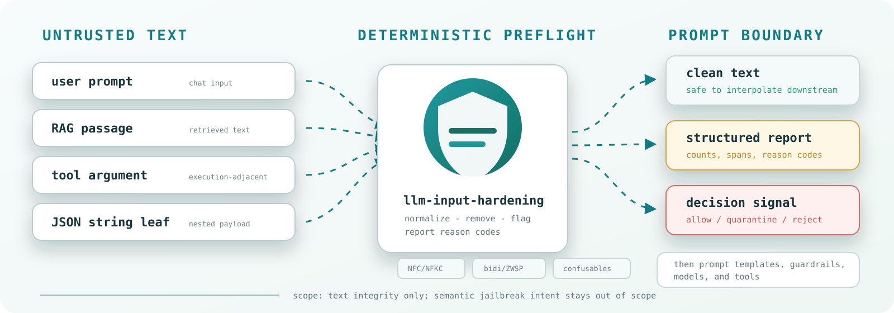
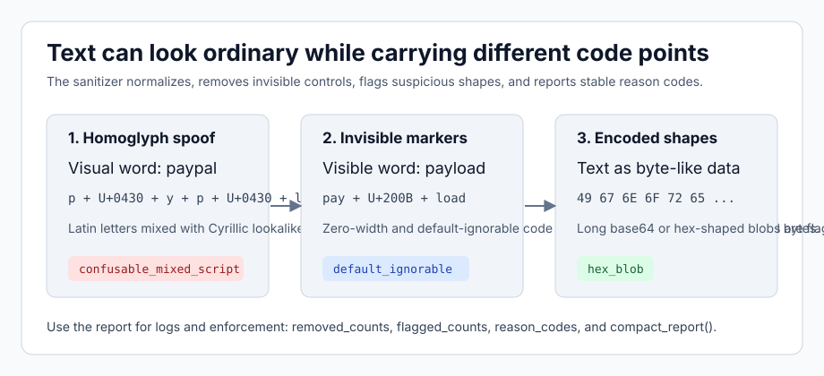

# llm-input-hardening

> The **input boundary**: what text LLMs and agents are allowed to read. Part of the
> [Forge](https://webstarcloud.com) `*-hardening` family, alongside `agent-api-hardening`
> (capability boundary) and `safegit` (recovery boundary).

Deterministic Unicode-aware input hardening for LLM applications.

`llm-input-hardening` sits between untrusted text and your prompt or template
layer. It bounds Unicode normalization, removes invisible or control characters
that destabilize prompts, emits structured reports for logging and enforcement,
and detects mixed- and whole-script confusables.

It is not prompt injection prevention. It addresses text-integrity problems, not model intent.

This README is the main entry point and quickstart. Deeper references — the full
report schema, policy details, threat model, integrations, and evaluation
methodology — live under [`docs/`](docs/).

The [hardening contract](docs/security/hardening-contract.md) defines the
guarantees, deliberate policy limits, and regression strategy across stages.

## Install

```bash
pip install llm-input-hardening
```

Optional extras:

- `pip install "llm-input-hardening[security]"` for the `confusable_homoglyphs` backend

Version **3.0.0** is licensed under [Apache 2.0](LICENSE). Its public Git history
starts with this release. See the [migration notes](docs/releases/3.0.0.md).

Encoded risky Unicode is inspected by default without decoding returned text.
HTML references (including inside `<...>`), Unicode escapes and percent-encoded
UTF-8 can produce quarantine signals; ordinary entities such as `&amp;` do not.
[Coverage, limits and integration](docs/security/encoded-unicode.md).

Output and reports are reproducible for pinned code, Python and dependency versions.

Import from `llm_input_hardening`.

## Quickstart

```python
from llm_input_hardening import sanitize

clean_text, report = sanitize(user_text, policy="balanced_chat")
```

Compact demo/report output:

```python
from llm_input_hardening import compact_report, sanitize

clean_text, report = sanitize(user_text, policy="balanced_chat")
summary = compact_report(report, sanitized_text=clean_text)
```

Recursive JSON sanitization:

```python
from llm_input_hardening import sanitize_json

clean_payload, report = sanitize_json(payload, policy="balanced_chat")
```

Enforcement-oriented usage:

```python
from llm_input_hardening import sanitize_and_decide

clean_text, report, decision = sanitize_and_decide(
    user_text,
    sanitize_policy="strict_exec",
    confusables_backend="confusable_homoglyphs",
)
```

Execution fields need their own schema after normalization. For example, require
an unchanged identifier from a known set:

```python
clean_text, report, decision = sanitize_and_decide(
    tool_name,
    sanitize_policy="strict_exec",
    reject_on_change=True,
    validator=lambda value: value in {"search", "summarize"},
)
if decision["action"] != "allow":
    raise ValueError("tool name rejected")
```

`validator` always sees the returned text; validation errors propagate. Paths
need application-specific root/allowlist checks, and code still needs parsing
and sandboxing. `strict_exec` by itself does not authorize execution.

If your application joins untrusted fragments, inspect the final assembly:

```python
from llm_input_hardening import sanitize_assembled

clean_text, report, decision = sanitize_assembled(
    retrieved_fragments, separator="\n\n", sanitize_policy="balanced_chat",
)
if decision["action"] != "allow":
    raise ValueError("assembled content requires review")
```

The helper joins raw fragments before inspection, with budgets for total
characters and part count. Individually allowed fields do not authorize a later
concatenation. Keep trusted message roles and instructions outside this helper.

The text API accepts at most 1,000,000 input characters by default (configurable
with `max_input_chars`). Requested spans are limited to 10,000 events. JSON
traversal also bounds nodes, total text, and report size; exceeding a limit
raises `ValueError` instead of returning a partially processed result.

For ASGI applications, use `ASGIPromptSanitizerMiddleware` with explicit protected
routes and selectors such as `messages[*].content` and
`messages[*].content[*].text`. With `enforce=True`, uninspected requests and
quarantine/reject decisions are blocked by default. See
[integration configuration](docs/integrations.md).

## Policies

| Policy | Normalization | Default-Ignorables | Whitespace tidy | Typical use |
| --- | --- | --- | --- | --- |
| `preserve` | NFC | preserve | no | low-friction logging and observability |
| `balanced_chat` | NFC | preserve | yes | general chat and prompt input |
| `strict_exec` | NFKC | strip | yes | tool arguments and execution-adjacent paths |
| `code_mode` | NFC | strip | no | code snippets and syntax-sensitive text |

Backward-compatible aliases are still accepted: `balanced`, `strict`, and `code`.

## Scope

Use this library for:

- user text before prompt interpolation
- retrieved text before it reaches the model
- tool and function argument strings
- JSON payloads with untrusted string keys or values

Do not use it as a substitute for:

- system prompt design
- tool sandboxing and allowlists
- output validation
- human review for high-risk actions

## How It Fits With Guardrails And Red-Teams

`llm-input-hardening` is a text-integrity layer. It is designed to run before,
inside, or alongside larger guardrail systems.



| Tool family | What it is good at | How this library fits |
| --- | --- | --- |
| NVIDIA NeMo Guardrails | Orchestrating input, output, retrieval, dialog, and tool rails; running content safety, PII, jailbreak, and model/policy checks. | Use this first in an input, retrieval, or tool-input rail when you want deterministic Unicode cleanup and structured text-integrity reports before semantic checks. |
| Promptfoo red teaming | Generating and evaluating adversarial test cases against your LLM app. | Use promptfoo to test the app. Use this library as one defensive layer, then measure overlap with promptfoo static obfuscation strategies. |
| Model-based prompt-injection detectors | Semantic classification of jailbreak or prompt-injection intent. | Complementary. This library does not infer intent; it makes suspicious text properties visible and policy-decidable. |

NeMo Guardrails exposes input/retrieval/tool rails, including jailbreak and
safety flows. Promptfoo exposes red-team strategy transforms such as Base64, Hex,
Homoglyph, and Emoji Smuggling. This package covers the deterministic text
integrity part of that space; it should not be described as a replacement for
either tool.

Useful references:

- [NeMo Guardrails rails configuration](https://docs.nvidia.com/nemo/guardrails/latest/configure-rails/configuration-reference.html)
- [NeMo Guardrails library integrations](https://docs.nvidia.com/nemo/guardrails/latest/user-guides/guardrails-library.html)
- [Promptfoo red-team configuration](https://www.promptfoo.dev/docs/red-team/configuration/)
- [Promptfoo multi-input red teaming](https://www.promptfoo.dev/docs/red-team/multi-input/)

## NeMo Guardrails Mapping

NeMo Guardrails is the orchestration layer. `llm-input-hardening` is a
deterministic text preflight layer you can call before a NeMo flow, from a
custom rail, or before handing text to a downstream model/API rail.

| NeMo area | Example checks or integrations | What this library adds |
| --- | --- | --- |
| Input rails | self check input, content safety, jailbreak heuristics/model, LlamaGuard, PII detection/masking | Normalizes/removes Unicode ambiguity before the rail sees text; emits report fields you can log or route on. |
| Retrieval rails | sensitive-data checks, retrieved-document policies | Sanitizes untrusted retrieved text before prompt assembly and records which sources carried obfuscation signals. |
| Tool input rails | action/tool argument validation | Applies `strict_exec` to execution-adjacent strings before tool calls. |
| Third-party guardrail integrations | GuardrailsAI, Prompt Security, Pangea AI Guard, Cisco AI Defense, and similar providers | Complements semantic/API checks with local deterministic cleanup and low-latency text-integrity telemetry. |
| Jailbreak detection heuristics/model | perplexity-style heuristics or model/NIM-based jailbreak detection | Different layer. This library does not decide semantic jailbreak intent; it removes and flags obfuscation that can distort prompt/log/tool text. |

## Promptfoo Static Obfuscation Strategy Mapping

This is not a certification claim or a claim that this package passes
promptfoo's full red-team suite. Treat it as a starting map for overlap with
promptfoo static obfuscation strategies.

| Promptfoo strategy | This library behavior | Notes |
| --- | --- | --- |
| Homoglyph | Flags mixed-script and whole-script confusables, including all-Cyrillic words that fold to ASCII-Latin skeletons. | Execution policies reject. Chat quarantines isolated/Latin-context or all-confusable text; native-prose candidates remain observable without automatic quarantine. The optional backend adds broader data. |
| Emoji Smuggling | `strict_exec` strips default-ignorable characters such as emoji variation selectors and ZWJ chains. `balanced_chat` preserves normal emoji behavior but still reports default-ignorable signals. | Use `strict_exec` for tool args and execution-adjacent strings; use `balanced_chat` for normal chat UX. |
| Base64 | Flags base64-shaped blobs. | It does not decode the blob or classify decoded intent. |
| Hex / alt encodings | Flags contiguous hex, promptfoo-style space-separated byte hex, ascii85/base85, and long binary-byte strings. | It does not decode the payload or classify decoded intent. |
| Indirect prompt injection | Helps clean and report Unicode/control-character obfuscation in retrieved text before prompt assembly. | It does not decide whether visible natural-language instructions are malicious. |
| Multi-input red teaming | Sanitizes JSON string keys and values with `sanitize_json()` and rejects sanitized-key collisions. | It does not reason about cross-field authorization or role confusion. |

See `examples/promptfoo-redteam-overlap/` for a small overlap harness that
imports promptfoo's built-in static strategy transforms and classifies which
generated payloads this package catches. The checked smoke fixture currently
catches `base64`, `hex`, `homoglyph`, and `emoji`.

## Homoglyphs And Invisible Text, Briefly

Some attacks do not rely on clever prose. They rely on text that humans and
machines see differently.



| Pattern | What happens | Example shape | What this library does |
| --- | --- | --- | --- |
| Bidi controls | Text can render in a different visual order than its logical order. | `abc\u202Edef` | Removes bidi controls and reports `bidi_control`. |
| Zero-width characters | Text can contain hidden separators or payload markers. | `pay\u200bload` | Removes known junk invisibles; strict policies strip broader default-ignorables. |
| Homoglyphs | Characters from different scripts can look like familiar Latin text. | `раypal` using Cyrillic `р` and `а` | Flags mixed-script confusables; enforcement can reject. |
| Whole-script homoglyphs | Every letter can be replaced while the word remains single-script. | all-Cyrillic `раураӏ` | Flags `whole_script_confusable`; stores the ASCII-Latin skeleton. |
| Styled forms | Compatibility letters or digits can look like ordinary ASCII. | mathematical bold, circled, small-caps, fullwidth `１００` | Flags `confusable_styled`; `strict_exec` may also fold forms via NFKC. |
| Normalization amplification | One compatibility character can expand to many normalized characters. | repeated `U+FDFA` | Streams normalization into an 8x/minimum-128 cap and rejects if truncated. |
| Emoji variation selectors / joiners | Emoji can carry invisible formatting characters or joiner chains. | heart variation selector, family ZWJ sequence | `balanced_chat` preserves normal emoji UX; `strict_exec` strips default-ignorables. |
| Encoding-shaped blobs | Payloads can be hidden in encoded-looking strings. | long base64, hex, ascii85, binary-byte strings | Flags the shape; does not decode or classify intent. |

The mental model:

1. Normalize text by policy.
2. Remove characters that make prompt/log/tool text ambiguous.
3. Flag suspicious shapes that should affect logging or enforcement.
4. Keep semantic safety checks separate.

## CLI

```bash
llm-input-hardening sanitize --text "abc‮def"
llm-input-hardening inspect --text "abc‮def"
llm-input-hardening inspect --compact --text "abc‮def"
llm-input-hardening decide --text "abc‮def"
llm-input-hardening decide --compact --text "abc‮def"
```

## Development

```bash
uv sync --all-extras
uv run maturin develop --release
uv run python -m pytest -q
```

Maintainers can prepare, publish and verify a new version with
`uv run --python 3.12 --no-project python scripts/release.py VERSION --notes-file /tmp/release-notes.md`.
Start with `--dry-run`; see [the release guide](docs/releasing.md) for access setup
and interruption recovery.

## Benchmarks And Bakeoff

The repo has two different evaluation paths.

- `bench/run_benchmarks.py` is a timing harness. It measures sanitizer latency and throughput on fixed synthetic inputs.
- `bench/run_bakeoff.py` is an evaluation harness. It runs labeled corpus cases, checks expected detections and postconditions, and computes precision, recall, benign-change rate, and stability signals.

Use the Make targets below:

```bash
make bench
make bench-plots

make bakeoff-smoke
make bakeoff-smoke-assert

make bakeoff-full
make bakeoff-full-assert
make bakeoff-diff
make bakeoff-diff-assert
```

What they mean:

- `bakeoff-smoke` is the fast local check. It evaluates only `llm-input-hardening` and writes results to `bench/results/bakeoff_smoke_latest.json`.
- `bakeoff-full` is the heavyweight comparison run. It installs `llm-guard` and `confusable-homoglyphs`, then writes comparable results to `bench/results/bakeoff_latest.json`.
- `bakeoff-diff` compares the current full run to a reviewed schema-4 baseline
  (`bench/results/bakeoff_baseline_schema4.json`, or `BAKEOFF_BASELINE=...`).
  Establish that baseline after reviewing a full run; historical schema-2 results
  are intentionally not comparable. See [baseline migration](docs/bakeoff/spec.md).

Generated reports stay under `bench/results/`.

## Repo Notes

- `CONTRIBUTING.md` covers contribution mechanics.
- `SECURITY.md` covers reporting and threat assumptions.
- `SCOPE.md` explains what the project is and is not trying to solve.
