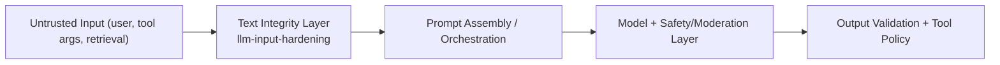

# Layering

Text integrity should run before orchestration and model safety layers.

`llm-input-hardening` is intentionally narrow:
- sanitize text deterministically
- emit signals and counts
- never make semantic policy claims
