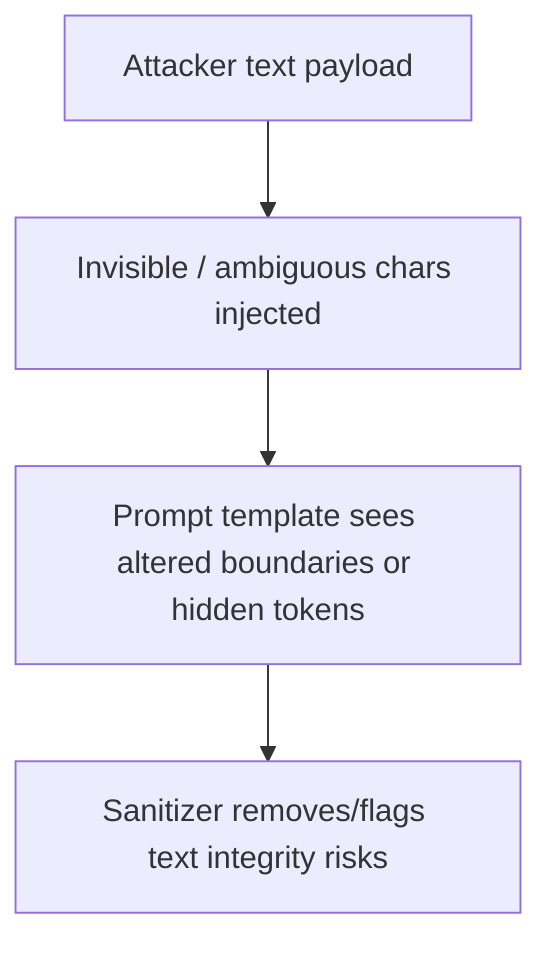

# Character Injection Attacks

## Covered patterns

- bidi override/inversion markers
- zero-width space insertion
- invisible tags and variation selectors (strict paths)
- emoji joiner/selector smuggling (observed vs removed by preset)
- homoglyph mixed-script keywords

## Example

- Input: `a\u200bd\u200bm\u200bi\u200bn`
- `balanced_chat` output: `admin` (ZWSP removed)
- report: `removed_counts.junk_invisible > 0`
