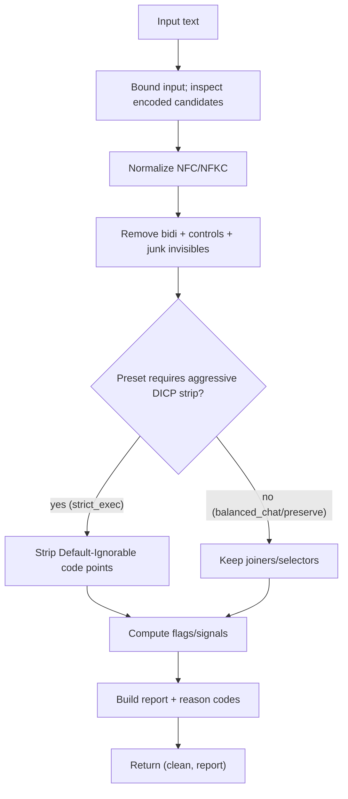

# Sanitize Flow

```mermaid
flowchart TD
    A["Input text"] --> B["Bound input; inspect encoded candidates"]
    B --> C["Normalize NFC/NFKC"]
    C --> D["Remove bidi + controls + junk invisibles"]
    D --> E{"Preset requires aggressive DICP strip?"}
    E -- "yes (strict_exec)" --> F["Strip Default-Ignorable code points"]
    E -- "no (balanced_chat/preserve)" --> G["Keep joiners/selectors"]
    F --> H["Compute flags/signals"]
    G --> H
    H --> I["Build report + reason codes"]
    I --> J["Return (clean, report)"]
```

The flow is linear in input size and deterministic for fixed versions/config.
