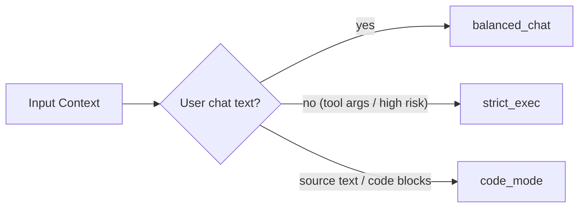

# Policy Presets



## Unicode behavior matrix

| Class / Behavior | `balanced_chat` | `strict_exec` |
|---|---|---|
| Normalization | NFC | NFKC |
| Bidi controls | remove | remove |
| C0/C1 controls (`\n`, `\t` excepted) | remove | remove |
| Known junk invisibles (ZWSP, BOM, WORD JOINER) | remove | remove |
| ZWJ/ZWNJ | preserve | remove |
| Emoji variation selectors | preserve | remove |
| Tag characters | preserve three RGI subdivision flags; remove others | remove all |
| Base64-like flag | yes | yes |
| High entropy flag | yes | yes |
| High combining ratio flag | yes | yes |
| Excessive combining stack flag | yes; quarantine | yes; quarantine |
| Confusable mixed-script flag | yes | yes |
| Whole-script confusable flag | yes | yes |
| Styled compatibility flag | yes | yes |
| Normalization expansion cap | yes | yes |

`code_mode` uses source-text defaults: NFC, no whitespace tidy, strict default-ignorable stripping, and confusable backend defaulting to `confusable_homoglyphs`.

Full matrix (strict/balanced/permissive + code mode): [Policy behaviour matrix](matrix.md).

## Backward-compatible aliases

- `balanced` -> `balanced_chat`
- `strict` -> `strict_exec`
- `code` -> `code_mode`

## Profile guidance

- `strict_exec`: identifier/tool-argument profile.
- `balanced_chat`: default free-text profile.
- `preserve`: lowest-touch free-text profile when formatting fidelity matters.

## Field contracts

Sanitization policy and field validity are separate. Both `decide_enforcement`
and `sanitize_and_decide` select the matching chat/strict enforcement defaults.
For identifiers, pass `reject_on_change=True` and a validator or allowlist:

```python
from llm_input_hardening import sanitize_and_decide

clean, report, decision = sanitize_and_decide(
    tool_name,
    sanitize_policy="strict_exec",
    reject_on_change=True,
    validator=lambda value: value in {"search", "summarize"},
)
if decision["action"] != "allow":
    raise ValueError("invalid tool name")
```

Validators receive the final sanitized string and must return a boolean. Errors
propagate instead of allowing the field. A false result remains a rejection
when the report is passed to `decide_enforcement` again. Paths need root and
allowlist validation appropriate to the application; code needs its language's
parser and execution sandbox. These cannot be inferred from Unicode properties.

High combining ratios are observable but do not cause default quarantine;
pathological stacks do. Whole-script candidates always remain observable, with
chat-only native-prose leniency. Encoded shapes remain conservative quarantine
signals, including legitimate long hashes/base64; use an explicit
`EnforcementPolicy` for fields where those forms are expected.
